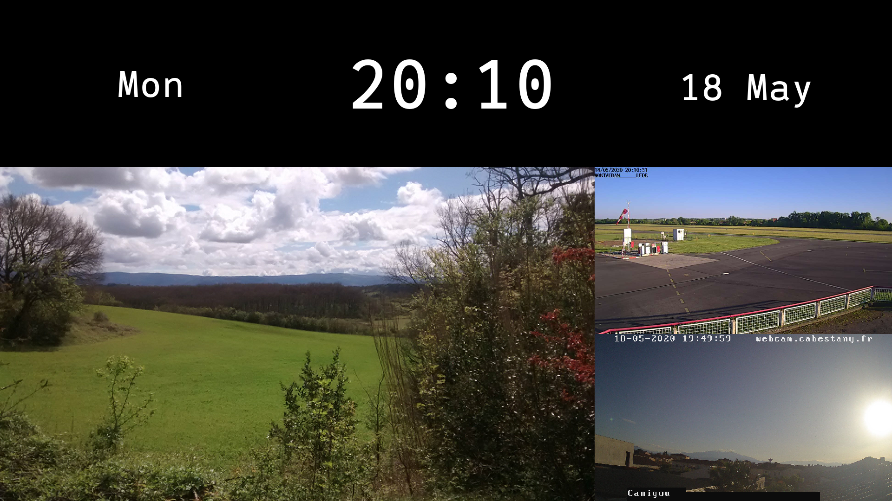
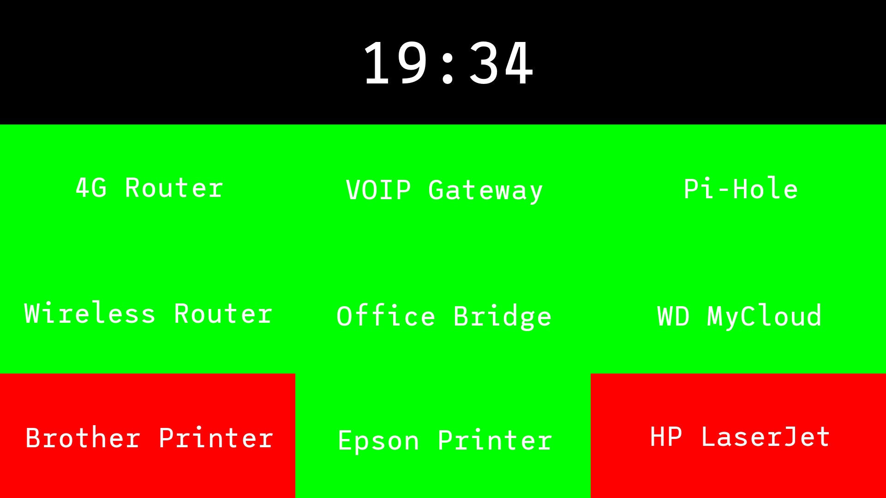

# fbinfogrid
Display a configurable grid of information and images on a Raspberry Pi (or other GNU/Linux) framebuffer.

## Screenshots
Clock, image carousel, and updating webcam snapshots...
 

Simple network device monitoring...
 

A copy of the information grid may optionally be made available via HTTP which will refresh every minute.

*fbinfogrid* builds and runs successfully on an original [Raspberry  Pi Model A](https://elinux.org/RPi_HardwareHistory#Raspberry_Pi_Model_A_Full_Production_Board) from 2013, so it should run fine on all modern 
platforms.  It should work fine on any other GNU/Linux platorm that supports a standard framebuffer
device and the [Go](https://golang.org/) language.

## Usage
Type ```./fbinfogrid -h``` for help.  

E.g. ```./fbinfogrid -config configs/demoSpans.json -http 8080```

You may supply a ```config.json``` file in the working directory or you can use the ```-config``` option 
to specify a grid configuration file.

If any cell has "refreshsecs" defined to be > 0 then the program will not exit until it is killed, 
otherwise the program will end once the grid has been drawn unless there are multiple pages (see below).

## Configuration
See the included JSON files in the [configs](configs) folder for configuration examples.

Note that _fbinfogrid_ takes the pixel dimensions of the specified framebuffer and uses them to calculate
the layout (i.e. cell sizes) by simple division.
There is no attempt made to intelligently 'flow' or fit the grid; you must ensure that the configuration you specify makes sense for your current framebuffer settings.
You can use the standard ```fbset``` program to check and alter the characteristics of the framebuffer.
Also, the image in the HTTP copy of the grid will have the same pixel dimensions as the framebuffer.

A configuration describes page(s) of cells... 

### Page
Page attributes are...

| Type     | Compulsory | Description |
|----------| :--------: |-------------|
| name     |     N      | Page description, not displayed |
| rows     |     Y      | No. of rows |
| cols     |     Y      | No. of columns |
| fontfile |     N      | Path of a TTF font, defaults to supplied LeagueMono-Regular.ttf |
| durationmins | N      | How many minutes to wait before moving to the next page (no default) |

See [demoTwoPages.json](configs/demoTwoPages.json) for a multiple-page example.

### Cells

Every cell **must** have ```row```, ```col```, and ```celltype``` specified.

You **may** also specify ```rowspan``` and ```colspan``` for any cell;
see [demoSpans.json](configs/demoSpans.json) for an example.
Note that the behaviour of overlapping cells is currently undefined.

Currently defined information cell types and associated attributes are...

|   Type      |  Description                   | fontpts | refreshsecs | scaling | source | text |
|-------------|--------------------------------| :-----: | :---------: | :-----: | :----: | :--: |
| carousel    | Slideshow of images            |    N    |      Y*     |    Y    |    **  |   N  |
| datemonth   | eg. "2 Jan"                    |    Y    |      Y      |    N    |    N   |   N  |
| day         | eg. "Mon"                      |    Y    |      Y      |    N    |    N   |   N  |
| daydatemonth | eg. "Mon 2 Jan"               |    Y    |      Y      |    N    |    N   |   N  |
| hostname    | eg. "raspipi01"                |    Y    |      N      |    N    |    N   |   N  |
| isalive     | Is a host reachable via TCP?   |    Y    |      Y*     |    N    |    Y*  |   Y  |
| localimage  | An image stored locally        |    N    |      Y      |    Y    |    Y*  |   N  |
| text        | Text that is never updated     |    Y    |      N      |    N    |    N   |   Y* |
| time        | eg. "15:04"                    |    Y    |      Y      |    N    |    N   |   N  |
| urlimage    | An image (JPEG/PNG) from a URL |    N    |      Y      |    Y    |    Y*  |   N  |

(* these attributes **must** be specified)

(** **must** specify a ```sources``` array - see [demoCarousel.json](configs/demoCarousel.json))  

Image cells that refresh (i.e. have a non-zero ```refreshsecs```) reload the image on each refresh, 
so if the underlying file changes that change will appear on the next refresh.

Scaling may be one of "fill", "fit", or "resize" (default).  Fill and fit maintain the aspect
ratio of the image, so there may be some cropping or borders apparent; resize scales the image to exactly 
fit the cell, so there may be some distortion.
